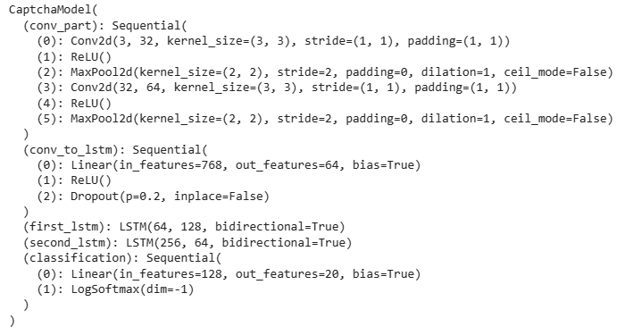
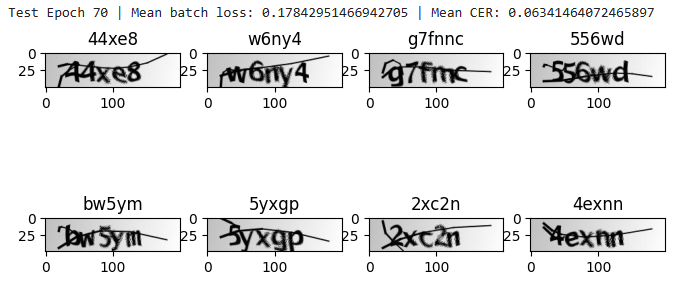
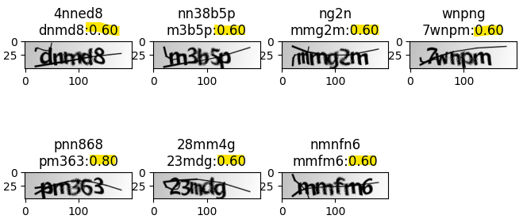

# iamrobot

# Lib description

## Установка.
В активном окружении выполнить из корня:
```
pip install -e [dev,test]
```
(если `zsh`)
```
pip install -e \."[dev,tests]"
```

## Настройка параметров и запуск
`config.yaml` позволяет выбирать конфигурацию для запуска обучения модели. Соответвсующие параметры будут переданы в `train` скрипт и при создании модели.

После настройки параметров скрипт обучения можно запустить командой `train` (в запущенном окружении).


## Результаты

### Модель
Модель обученная на полных данных (скорее всего переобучена немного). 
Архитектура модели


Результаты



    Верно предсказанных слов: 85.14%
    Верно предсказанных букв: 96.79%

### Ошибки

Изображения с наибольшей ошибкой `CER`
 


### Выводы

1. Модели сложно различать символы, если одна часть символа есть другой символ/часть другого символа:  $(m,n), \ (3,8), \ (c,e), \ (d,4), \ (b,4)$. Важно что порядок в паре имеет смысл было$\rightarrow$предсказано. Потому что в обратном варианте ошибок гораздо меньше (если длины предсказанных слов верные).

2. Сложно воспринимать последовательность букв, которые способны порождать другие буквы и понимать количество таких букв, если они стоят рядом: $n \rightarrow nn; \ nn \rightarrow m; \ w \rightarrow ww; \ ww \rightarrow w; \ m \rightarrow nn; \ m \rightarrow nm$ и так далее. 

**Первый пункт** возможно попробовать решить увеличением области обзора модели - увеличить размер едра сверток или их количество. Однако это может ускорить переобучение модели под выборку (а переобучение и сейчас есть).

**Второй** (и первый) пункт можно попробовать исправить, уменьшив длину последовательности на выходе. Это тоже своего рода увеличение области видимости на один вектор последовательности.